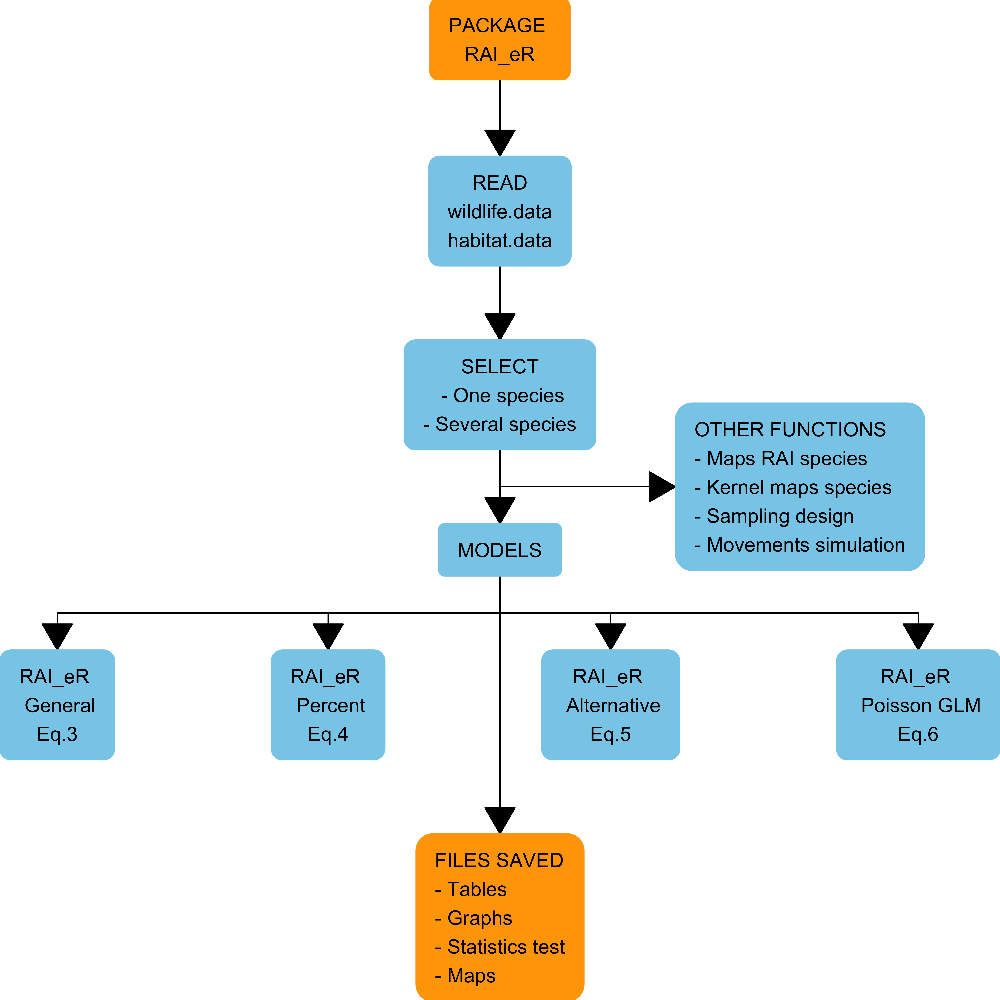
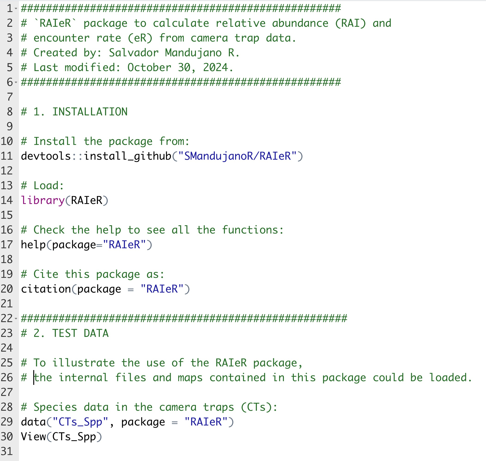

# Package `RAIeR`

## Objectives of this package:

The main objective of this package is to calculate the relative abundance index (RAI) and the encounter rate (eR) with data obtained from camera traps. For this purpose, the package generates RAIeR based on three models: grouping all data, by camera trap, and as a generalized linear model.



## Functions

`RAIeR` creates specific subdirectories (named by the user) to save all the results: graphs, tables, statistical tests, maps, and others, using different functions:


## General process

It is suggested to execute the following processes separately: 

  1) Preparation and formatting of the data before using the `RAIeR` package, 
  
  2) Load the map of the study area in "shapefile" format and adequate projection, 
  
  3) Analysis of the RAI for comparison of the same species in the same locality, or between localities, years, and seasons, and 
  
  4) Analysis of the encounter rate (eR) between different species in the same study area or between localities.

## Initial steps

### Previously installed packages:

```
install.packages(c("adehabitatHR", "agricolae", “akima", "camtrapR", "ggplot2", "fuzzySim", 
                    "leaflet", "mapview", "MASS", "RColorBrewer", "sp", "sf", "terra", 
                    "tidyverse", "xtable"))
```

Additionally, to save Esri maps as images, install the package `webshot` as:

```
library(devtools)
install_github("wch/webshot")
webshot::install_phantomjs()
```

### Install and load the RAIeR package:

Download and run the package from:

```
install_github("SMandujanoR/RAIeR")
library(RAIeR)
```

## Create RStudio project

Preferably, you should create a project in RStudio, and include two folders named "data" and "shapes." 


Preferably, you should create a project in RStudio, and include two folders named "data" and "shapes." 


The first folder includes the three files with the species "data.frame" (usually generated from the `camtrapR` package or programs such as `WildID`, `Camelot`, `CameraBase` or others). In this example named "CT_habitat.csv", "CT_operativity" and "CT_Spp.csv". In the second folder include the shapefile and raster files of the study area. 

Also, in the main folder, it is necessary to include the R Script (named "Script_Master2.R" in this example), which contains the lines needed to execute all the functions required in a project. These lines can be copied directly from the HTML vignettes 1 to 7 described here.

## Suggestion to run `RAI_eR`

In the folder  "inst" is a file containing the complete script to execute all the functions. I suggest you download it and include it in the project folder in RStudio. The The file is named as `Script_Master.R`: 



## Consult:

  1) Mandujano, S. 2019. Índice de abundancia relativa: RAI. Pp. 131-144, in: S. Mandujano & L. A. Pérez-Solano (eds.), Foto-trampeo en R: Organización y análisis de datos, Volumen I. Instituto de Ecología A. C., Xalapa, Ver., México. 243pp. <https://www.researchgate.net/publication/340413631_MANDUJANO_S_2019_Indice_de_abundancia_relativa_RAI>

  2) Mandujano, S. 2024. Índices de abundancia relativa y tasas de encuentros con trampas cámara: conceptos, limitaciones y alternativas. Mammalogy Notes, 10(1), 389. <https://doi.org/10.47603/mano.v10n1.389> 

  3) Tutorial on using R for photo trapping data at: https://rpubs.com/SMR8810/FTR_reproducible

  4) The book: "FototrampeoR: Organización y Análsis de Datos, Volume 1" at: https://smandujanor.github.io/Foto-trampeo-R-Vol_I

  5) PDF of the book at: https://www.researchgate.net/publication/348922971_Fototrampeo_en_R_Organizacion_y_Analisis_de_Datos_Volumen_I

