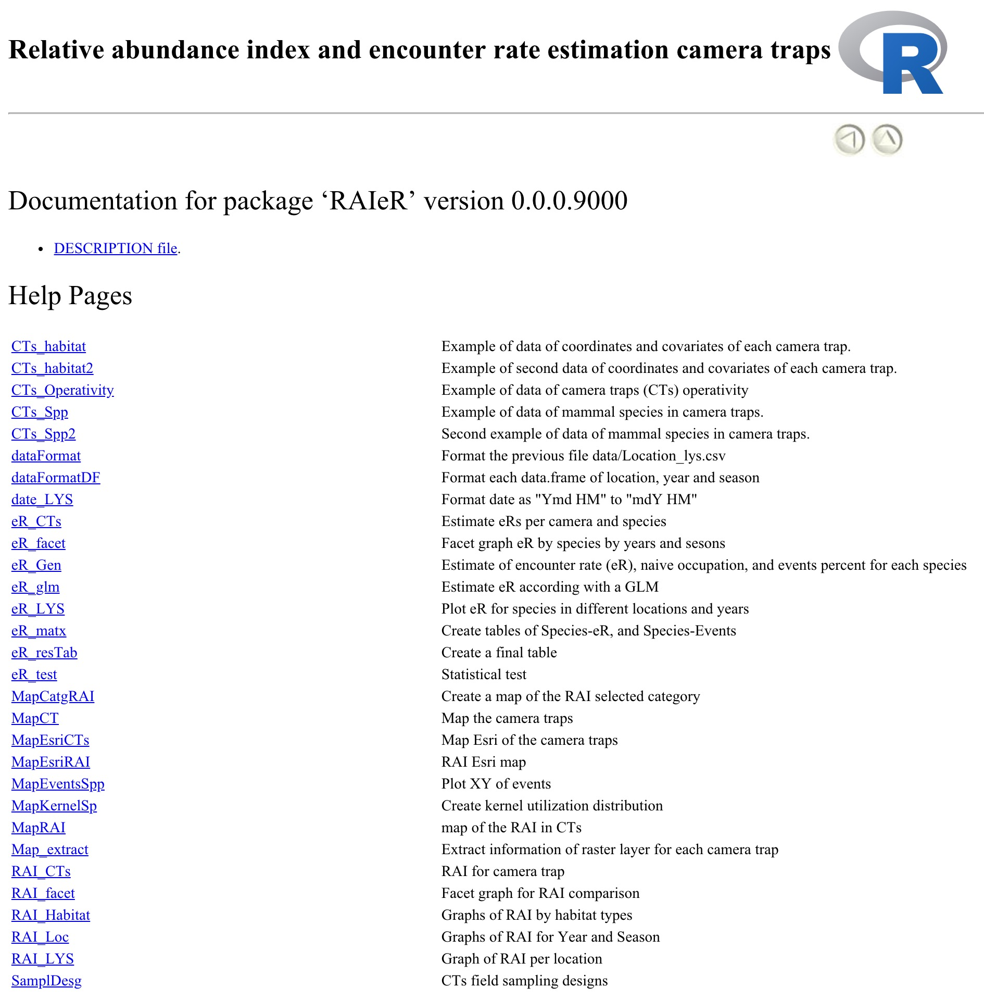

# Package `RAIeR`

## Objectives of this package:

The main objective of this package is to calculate the relative abundance index (RAI) and the encounter rate (eR) with data obtained from camera traps. For this purpose, the package generates RAIeR based on four models: 

- grouping all data, 
- by camera trap, 
- as a percentage relative to all species, and 
- as a generalized linear model.


## Functions

`RAIeR` creates specific subdirectories (named by the user) to save all the results: graphs, tables, statistical tests, maps, other, using different functions:



## General process

It is suggested to execute the following processes separately: 

  1) Preparation and formatting of the data before using the `RAIeR` package, 
  
  2) Load the map of the study area in "shapefile" format and adequate projection, 
  
  3) Analysis of the RAI for comparison of the same species in the same locality, or between localities, years, and seasons, and 
  
  4) Analysis of the encounter rate (eR) between different species in the same study area or between localities.

## Initial steps

### Previously installed packages:

```
install.packages(c("adehabitatHR", "agricolae", “akima", "camtrapR", "ggplot2", "fuzzySim", 
                    "leaflet", "mapview", "MASS", "RColorBrewer", "sp", "sf", "terra", 
                    "tidyverse", "xtable"))
```

Additionally, to save Esri maps as images, install the package `webshot` as:

```
library(devtools)
install_github("wch/webshot")
webshot::install_phantomjs()
```

### Install and load the RAIeR package:

Download and run the package from:

```
install_github("SMandujanoR/RAIeR")
library(RAIeR)
```

## Main updates of the last version of this package:

  1) Functions to format the `data.frame` obtained with `camtrapR`, `Wild.ID`, or `CameraBase`.

  2) Transition to `terra` and `sf` packages instead of `raster` and `rgdal`.

  3) Specific functions to analyze the RAI for one selected species and functions to calculate the eR for several species.

## Consult the following previously to use the `RAIeR` package:

  1) Mandujano, S. 2019. Índice de abundancia relativa: RAI. Pp. 131-144, in: S. Mandujano & L. A. Pérez-Solano (eds.), Foto-trampeo en R: Organización y análisis de datos, Volumen I. Instituto de Ecología A. C., Xalapa, Ver., México. 243pp. <https://www.researchgate.net/publication/340413631_MANDUJANO_S_2019_Indice_de_abundancia_relativa_RAI>

  2) Mandujano, S. 2024. Índices de abundancia relativa y tasas de encuentros con trampas cámara: conceptos, limitaciones y alternativas. Mammalogy Notes, 10(1), 389. <https://doi.org/10.47603/mano.v10n1.389> 

  3) Tutorial on using R for phototrapping data at: https://rpubs.com/SMR8810/FTR_reproducible

  4) The book: "FototrampeoR: Data Organization and Analysis, Volume 1" at: https://smandujanor.github.io/Foto-trampeo-R-Vol_I

  5) PDF of the book at: https://www.researchgate.net/publication/348922971_Fototrampeo_en_R_Organizacion_y_Analisis_de_Datos_Volumen_I

  6) Material (R codes and data) from the book: https://smandujanor.github.io/Foto-trampeo-R-Vol_I
  
